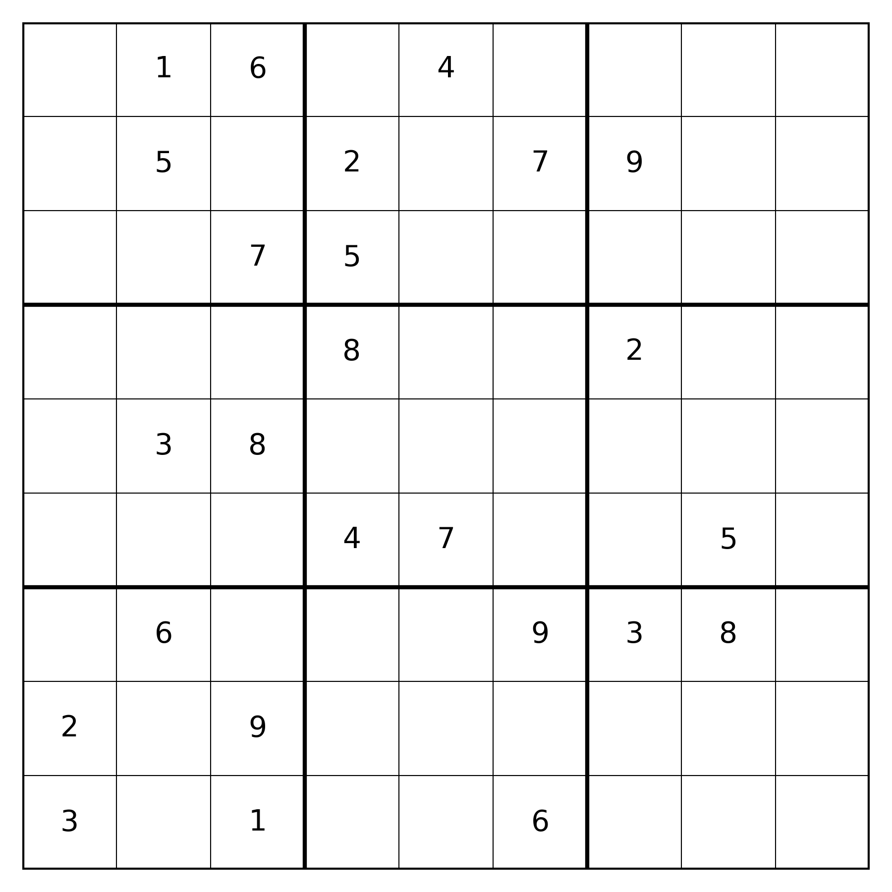
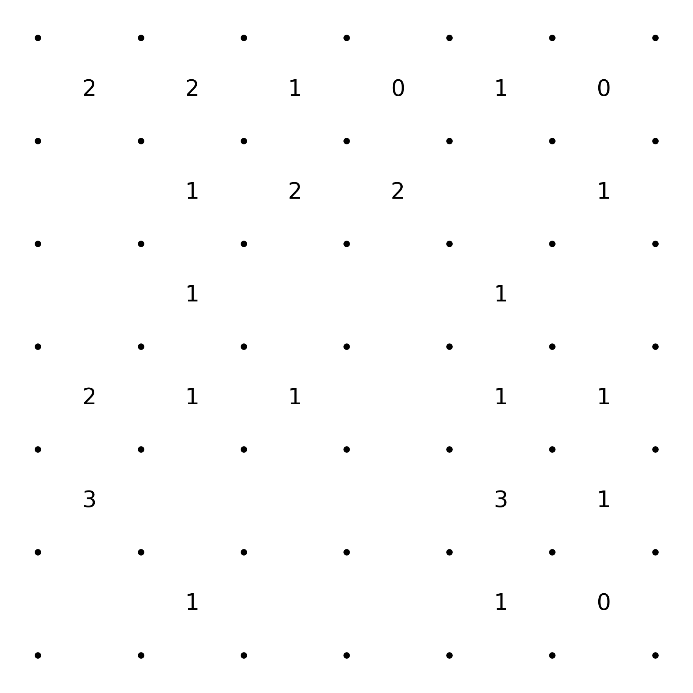
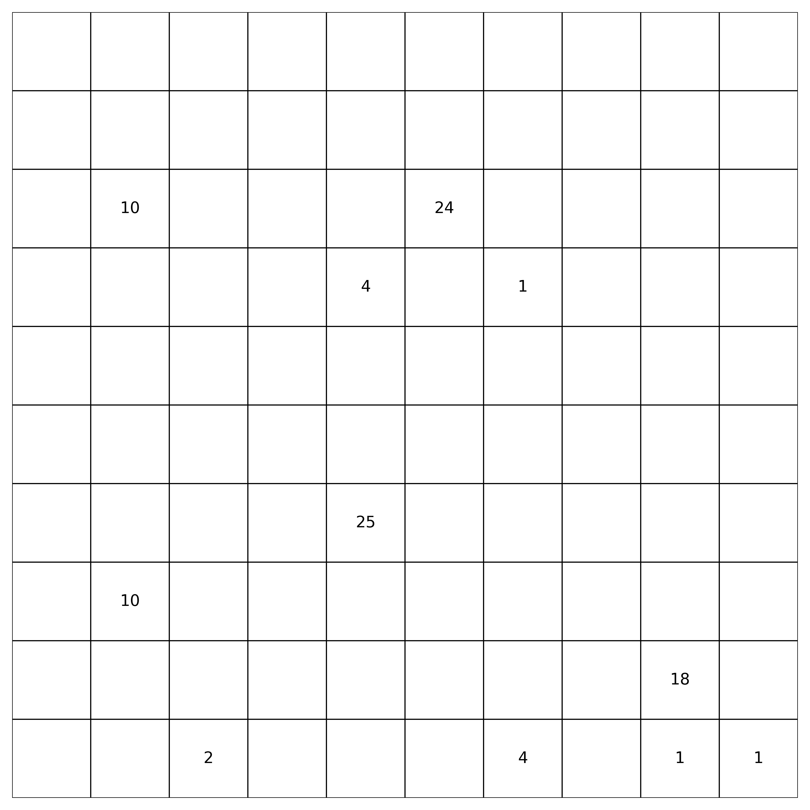
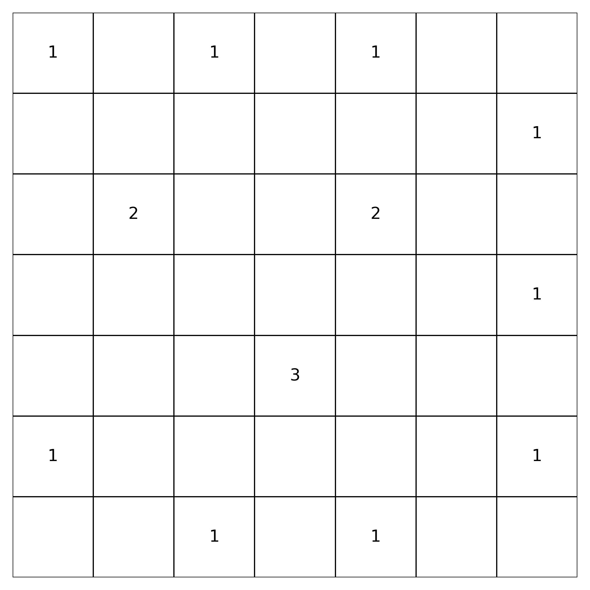
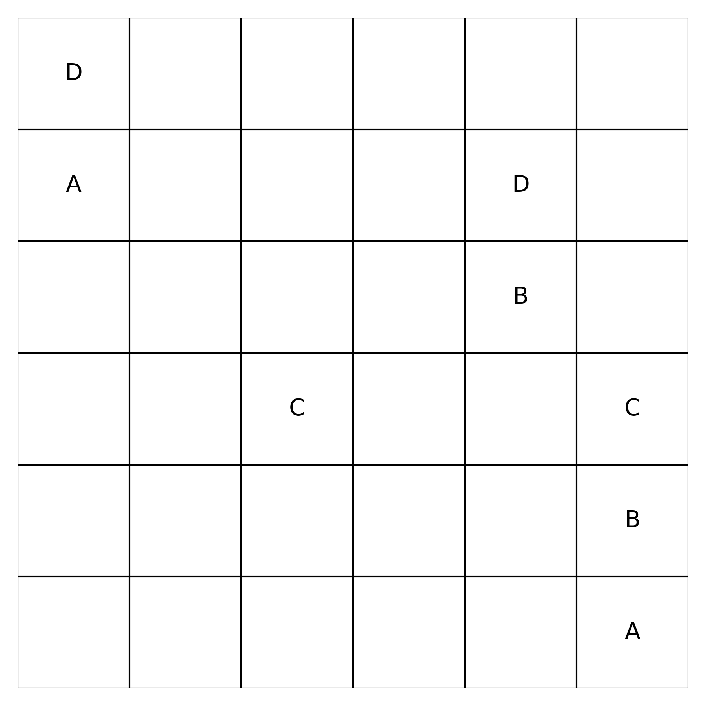

# Logic puzzles generators

## Description

This project contains generators for five types of logic puzzles: **Sudoku**, **Slitherlink**, **Shikaku**, **Nurikabe**, and **Numberlink**.

Each puzzle includes at least two separate generator implementations:
- One based on a **genetic algorithm**,
- Another based on an **alternative approach**, such as **backtracking**.

At the top of each generator script, you'll find configurable parameters. You can freely modify them to adjust the generator to your needs.
Each generator saves the generated puzzle to a .csv file in a format that allows easy copying of clues. Additionally, a .png image of the puzzle is also generated.
The algorithm used in each generator, along with its specific characteristics, is described at the top of the corresponding script file.

Three out of the five generators use publicly available solvers found online.

- The **Nurikabe** and **Numberlink** generators are distributed under the **MIT License**, allowing free and flexible usage.
- The **Slitherlink** generator uses the **GNU Affero General Public License (AGPL)**, which applies to the entire project and is included in the root directory.

## Demo

Here are sample outputs for each puzzle:

- **Sudoku:**  
  

- **Slitherlink:**  
  

- **Shikaku:**  
  

- **Nurikabe:**  
  

- **Numberlink:**  
  

## Requirements

- Python 3.8 or newer
- Install required packages with:
  ```bash
  pip install -r requirements.txt

## Installation and usage

1. Clone repository:
   ```bash
   git clone https://github.com/JanZon00/Puzzle-Generators.git
   cd Puzzle-Generators
2. Install dependencies:
   pip install -r requirements.txt
2. Navigate to the folder of the puzzle type you want to generate, set the desired parameters at the top of the script, and run it.
   Example:
   cd shikaku
   python shikaku_genetic.py

## License

Nurikabe and Numberlink solvers: MIT License
Slitherlink: GNU AGPL v3 — full license available in the root directory

## Author: 
Jan Zoń 
https://github.com/JanZon00